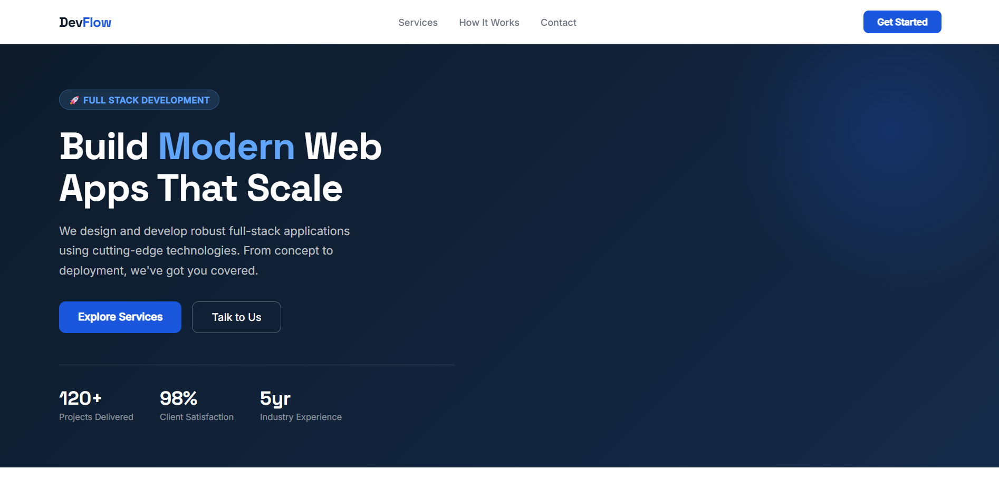
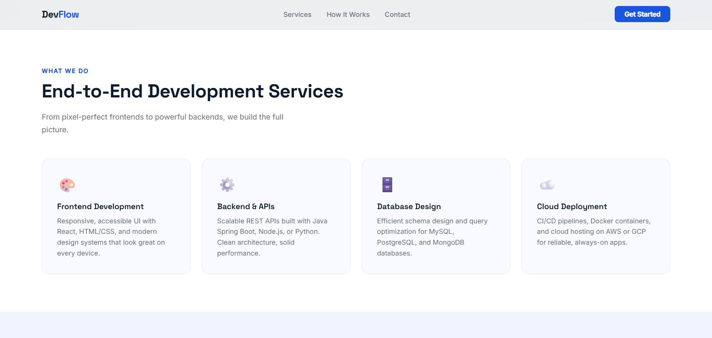
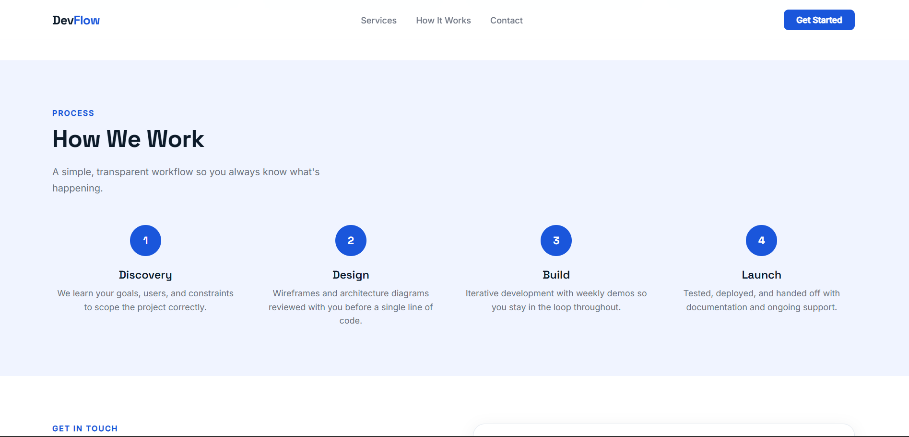
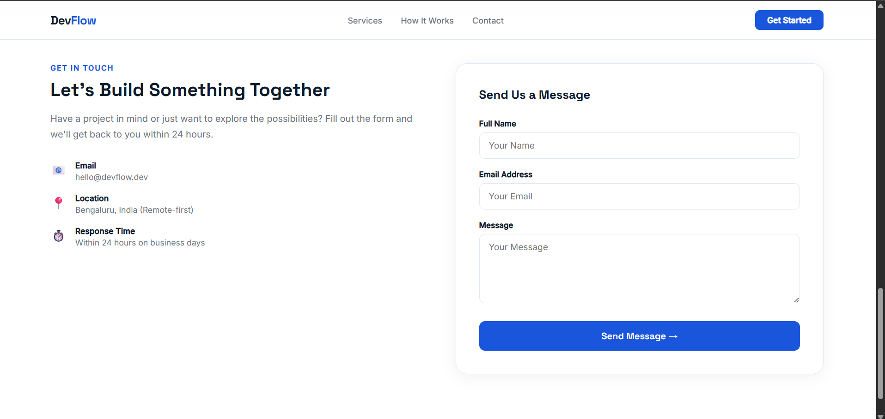
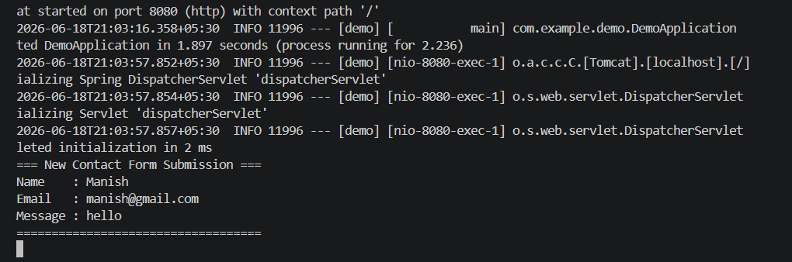

# 🚀 Task 1 - Landing Page + Contact Form
### Maincrafts Technology Internship — Java Full Stack Web Development

---

## 📸 Project Screenshots

### 🏠 Hero Section


### 🛠️ Services Section


### ⚙️ How It Works Section


### 📬 Contact Form


### 💻 Backend Terminal Output


---

## 📌 About This Project
A modern full-stack web application built as part of the **Maincrafts Technology Internship**.  
The project consists of a responsive landing page with a contact form connected to a **Java Spring Boot** backend that receives and prints form submissions.

---

## 🛠️ Tech Stack

| Layer | Technology |
|-------|-----------|
| Frontend | HTML5, CSS3, JavaScript |
| Backend | Java Spring Boot |
| Server | Apache Tomcat (embedded) |
| Build Tool | Maven |

---

## ✅ Features
- ✔️ Modern responsive landing page
- ✔️ Services section with cards
- ✔️ How It Works process section
- ✔️ Contact form with Name, Email, Message fields
- ✔️ Form data received by Spring Boot REST Controller
- ✔️ Submitted data printed in backend console

---

## 📁 Project Structure
```
task1/
├── src/
│   └── main/
│       ├── java/com/example/demo/
│       │   ├── DemoApplication.java       ← Spring Boot entry point
│       │   └── ContactController.java     ← Handles POST /contact
│       └── resources/
│           └── static/
│               └── index.html             ← Landing page
├── screenshots/                           ← Project screenshots
└── pom.xml                                ← Maven dependencies
```

---

## ▶️ How to Run

### Prerequisites
- Java 17+
- Maven

### Steps
```bash
# Clone the repository
git clone https://github.com/Maaanishhh/maincrafts-task1.git

# Navigate to project folder
cd maincrafts-task1

# Run the Spring Boot app (Windows)
mvnw.cmd spring-boot:run
```

Then open your browser and go to:
```
http://localhost:8080
```

---

## 🔗 How It Works
1. User fills the contact form on the landing page
2. JavaScript sends a `POST` request to `/contact`
3. Spring Boot `@RestController` receives Name, Email, Message
4. Data is printed in the console

### Backend Output Example:
```
=== New Contact Form Submission ===
Name    : Manish Sharma
Email   : manish@gmail.com
Message : Hello!
===================================
```

---

## 👨‍💻 Developed By
**Manish Sharma**  
Maincrafts Technology Virtual Internship  
Domain: Java Full Stack Web Development  
Task: 1 of 6
